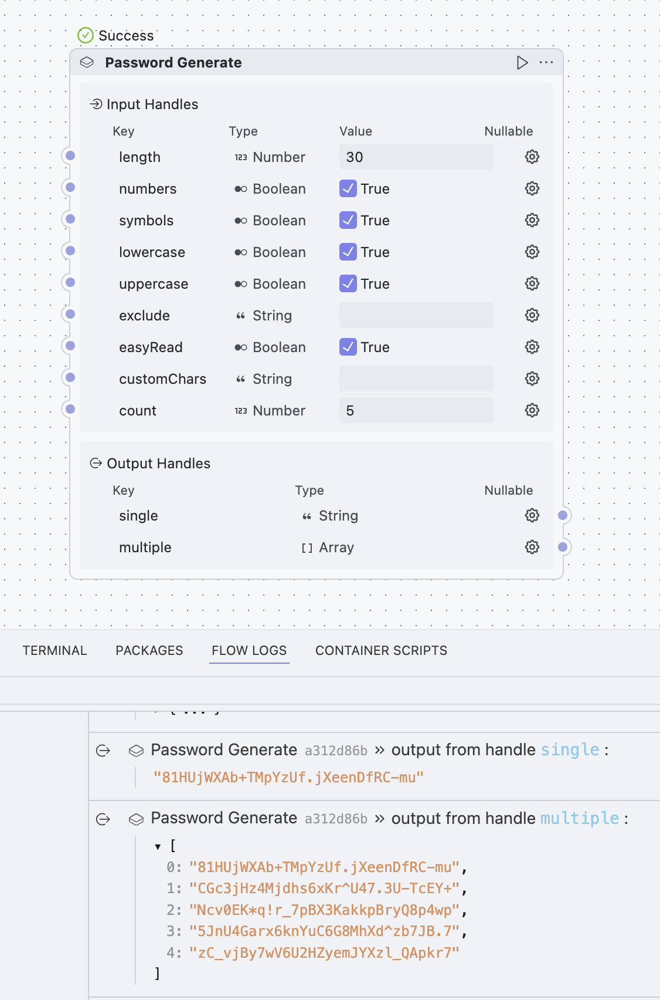

# Password Generator Block

A secure password generator block for OOMOL platform that creates strong, customizable passwords with various options.

## 🔒 What is the Password Generator Block?

The Password Generator Block is a tool that automatically creates secure passwords for you. Whether you need one password or hundreds, this block can generate them instantly with your preferred settings. No more struggling to come up with strong passwords - just set your preferences and get secure passwords in seconds!

## 🌟 Key Features

- **Customizable Length**: Generate passwords from 1 to any length you need
- **Multiple Character Types**: Choose from uppercase letters, lowercase letters, numbers, and symbols
- **Batch Generation**: Create multiple passwords at once (1 to any quantity)
- **Easy-to-Read Mode**: Avoid confusing characters like 0/O, 1/l/I for better readability
- **Character Exclusion**: Exclude specific characters you don't want
- **Custom Character Set**: Use your own set of characters instead of default ones
- **Secure Generation**: Uses cryptographically secure random number generation

## 🎯 Who Can Use This?

- **System Administrators**: Generate secure passwords for user accounts
- **Developers**: Create API keys, tokens, or test passwords
- **Security Teams**: Generate passwords for testing or security assessments
- **Business Users**: Create strong passwords for various applications
- **Anyone**: Who needs secure, random passwords quickly

## 🚀 How to Use

### Basic Usage

1. **Add the Block**: Drag the Password Generator block into your workflow
2. **Set Password Length**: Choose how many characters your password should have (default: 10)
3. **Choose Character Types**: Select which types of characters to include:
   - ✅ Uppercase letters (A-Z)
   - ✅ Lowercase letters (a-z)
   - ✅ Numbers (0-9)
   - ✅ Symbols (!@^*_+-.)
4. **Run**: Execute the workflow to generate your password

### Advanced Options

#### Generate Multiple Passwords
- Set **Count** to any number to generate multiple passwords at once
- Perfect for creating passwords for multiple users or accounts

#### Easy-to-Read Mode
- Enable **Easy Read** to avoid confusing characters
- Excludes: 0, o, O, 1, i, I, l, L, !, 9, g, 5, s, S
- Great for passwords that need to be typed or shared verbally

#### Exclude Specific Characters
- Use **Exclude** field to remove specific characters you don't want
- Example: Enter "0O1l" to avoid easily confused characters

#### Custom Character Set
- Use **Custom Chars** to define your own character set
- When set, this overrides all other character type settings
- Example: "ABCDEF123456" for hexadecimal-style passwords

## 📊 Output Options

The block provides two outputs:

1. **Single**: The first generated password (string)
2. **Multiple**: All generated passwords (array of strings)

Use **Single** when you need just one password, or **Multiple** when generating several passwords at once.

## 💡 Usage Examples

### Example 1: Basic Strong Password
- Length: 12
- Include: Uppercase ✅, Lowercase ✅, Numbers ✅, Symbols ✅
- Result: `A7$nK9mX@2pL`

### Example 2: Easy-to-Read Password
- Length: 10
- Include: Uppercase ✅, Lowercase ✅, Numbers ✅
- Easy Read: ✅
- Result: `A7nK3mX2pF`

### Example 3: Multiple PIN Codes
- Length: 4
- Include: Numbers ✅ (others disabled)
- Count: 5
- Result: `["8273", "1594", "6038", "7421", "9865"]`

### Example 4: Custom Corporate Password
- Length: 8
- Custom Chars: `ABCDEFGHJKMNPQRSTUVWXYZ23456789`
- Result: `M7K3NP4R`

## 🔐 Security Features

- **Cryptographically Secure**: Uses Node.js crypto.randomBytes for true randomness
- **No Patterns**: Ensures passwords don't follow predictable patterns
- **Character Diversity**: In strict mode, guarantees at least one character from each selected type
- **Secure Shuffling**: Uses cryptographic randomness for character positioning

## 🎨 Visual Interface

The block provides an intuitive interface with:
- Number sliders for length and count
- Checkboxes for character types
- Text fields for exclusions and custom characters
- Toggle switches for special modes

## 📸 Screenshot

## 🔧 Technical Details

- **Platform**: OOMOL
- **Runtime**: Node.js/TypeScript
- **Security**: Crypto-secure random generation
- **Performance**: Fast generation even for large batches
- **Memory**: Efficient for any reasonable password count

## 🆘 Troubleshooting

**No characters available error**: This happens when your exclusion rules remove all possible characters. Check your exclude settings and character type selections.

**Generated password too short**: When using strict mode with many character types, ensure the password length is at least as long as the number of character types selected.

## 🎯 Best Practices

1. **Use appropriate length**: Minimum 8 characters, 12+ recommended
2. **Mix character types**: Include multiple types for stronger passwords
3. **Consider the use case**: Use easy-read mode for passwords that need to be shared
4. **Test before deployment**: Generate a few test passwords to verify settings
5. **Document exclusions**: Keep track of any character exclusions for consistency
